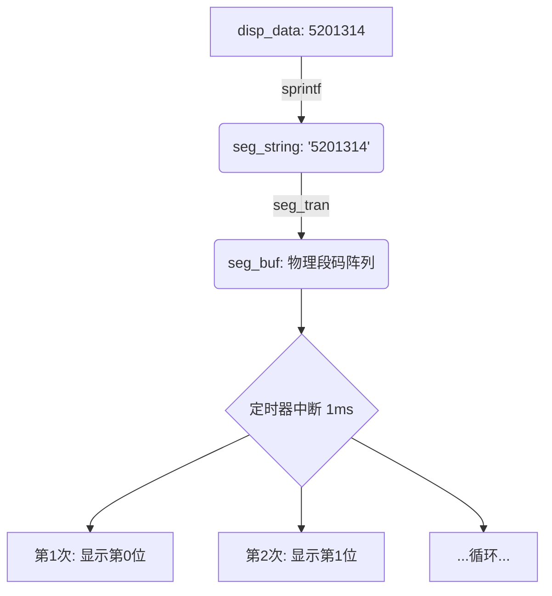

# STC15F2K60S2 单片机开发笔记：数码管显示与定时器扫描

## 一、 核心知识点概览
本程序展示了单片机开发中典型的**“定时器中断+动态扫描”**架构。
1. **动态扫描机制**：通过定时器每 1ms 切换一位数码管，利用人眼视觉暂留效应实现多位显示。
2. **标准库 `stdio.h` 的应用**：使用 `sprintf` 将数值灵活地转化为字符串。
3. **数据缓冲与转换**：数据从 `变量` -> `字符串` -> `段码缓冲` -> `硬件显示` 的全过程。

---

## 二、 关键语法与函数解析

### 1. `sprintf` 格式化字符串
在单片机中，直接处理数字显示比较麻烦，`sprintf` 是利器。
```c
sprintf(seg_string, "%7lu", disp_data);
```
*   **作用**：将 `unsigned long` 类型的 `disp_data` 转换成字符串存入 `seg_string`。
*   **格式控制**：
    *   `%7lu`：其中的 `7` 表示占 7 位宽度，`l` 表示长整型，`u` 表示无符号。如果数字不足 7 位，左侧会自动补空格。
    *   **注意**：原代码中 `%7l  u` 中间的空格会原样输出到字符串中，建议紧凑编写。

### 2. 数码管映射逻辑 `seg_tran`
```c
seg_tran(seg_string, seg_buf);
```
*   这是一个转换函数（通常定义在 `seg.c` 中）。
*   它遍历字符串 `seg_string`，根据字符（如 '5', '2', '0' 或空格）查找对应的**段码**（如 0x3f, 0x06 等），并存入 `seg_buf` 数组中。

### 3. 定时器中断服务程序 (ISR)
```c
void tim_isr() interrupt 3
```
*   **interrupt 3**：对应定时器 1 的中断入口。
*   **ms_Tick**：系统滴答计数，用于精确计时。
*   **动态扫描逻辑**：
    ```c
    seg_disp(seg_buf, pos); // 显示当前位
    pos++;                  // 准备下一位
    if(pos == 8) pos = 0;   // 8位数码管循环扫描
    ```
    *通常每秒扫描 50 次以上（即总周期 < 20ms）人眼就不会感觉到闪烁。这里 1ms 切换一位，8 位总周期 8ms，显示效果非常稳定。*

---

## 三、 硬件资源分配记录

| 资源名称       | 变量/标志    | 作用说明                           |
| :------------- | :----------- | :--------------------------------- |
| **滴答计时**   | `ms_Tick`    | 记录系统运行总毫秒数               |
| **显示缓冲**   | `seg_buf[8]` | 存放 8 位数码管的物理段码          |
| **当前位指针** | `pos`        | 指向当前正在点亮的那位数码管 (0-7) |
| **LED 状态**   | `ucled`      | 存储点灯状态的 8 位变量            |

---

## 四、 核心代码结构分析

### 1. 初始化阶段 (`main` 前部)
1. `per_init()`：初始化外设（关闭蜂鸣器、继电器等，防止乱动）。
2. `sprintf(...)`：将数据格式化。
3. `seg_tran(...)`：将格式化后的字符串转为数码管段码。
4. `Timer1_Init()`：最后开启定时器，启动中断扫描。

### 2. 运行逻辑
*   **主循环 `while(1)`**：可以留空，或者处理非实时的任务（如按键逻辑、串口解析）。
*   **中断服务**：负责所有“实时性”要求高的工作，如**刷新数码管**、**点亮 LED**。

---

## 五、 避坑指南
1. **字符串长度**：`seg_string` 数组大小必须足够大。例如 `%7lu` 至少需要 8 个字节（含 `\0` 结束符）。
2. **sprintf 开销**：`sprintf` 比较耗费 Flash 空间和执行时间。在资源极度紧张的单片机（如只有 2KB Flash 的型号）上要慎用，但 STC15F2K60S2 资源充足，可以放心使用。
3. **中断冲突**：中断服务程序里的代码要尽可能精简。不要在中断里使用 `sprintf` 或长时间延时。

---

### 附：代码逻辑流程图


---
**提示**：如果你需要 `seg.h` 或 `timer.h` 内部的具体寄存器配置笔记，可以随时发给我，我帮你继续补充。