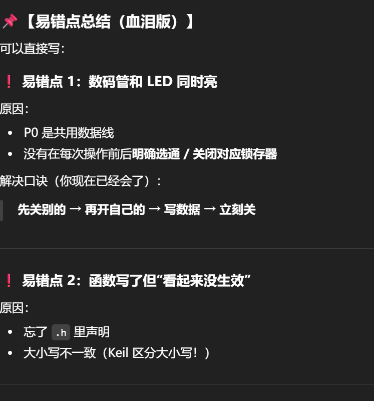
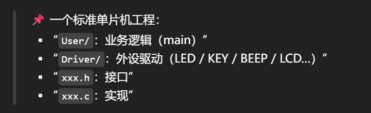

# 第一周单片机有关内容
---


# 理论知识

1. 寄存器
2. 锁存器
3. 译码器
4. 任门
5. 或门
6. 二进制转十六进制


---

## 一、寄存器（Register）

### 1️⃣ 概念

寄存器是**单片机内部的一种存储单元**，用于暂时存放数据或控制信息。

👉 特点：

- 在 CPU 内部
- 速度最快
- 容量很小


### 2️⃣ 生活类比

把单片机想象成一个人：

- 大脑：CPU
- 手里捏着的小纸条：**寄存器**
- 书包：RAM

👉 正在用的数据，一定先放在“手里的纸条”上。


### 3️⃣ 在单片机中的作用

- 保存运算数据
- 控制硬件状态
- IO 口本质上也是寄存器

📌 结论：

> **操作寄存器 = 操作硬件**


### 4️⃣ 记忆口诀

> 小、快、贵，离 CPU 最近

------

## 二、锁存器（Latch）

### 1️⃣ 概念

锁存器是一种**能够保持状态不变的存储电路**。


### 2️⃣ 生活类比

像按压式台灯：

- 按一下 → 开
- 再按一下 → 关

👉 手松开后，灯的状态仍然保持。


### 3️⃣ 作用

- 保存输出状态
- 防止状态丢失

📌 在单片机中：

- 用于 IO 口输出保持
- LED、数码管显示保持


### 4️⃣ 核心理解

> **给一次信号，状态一直在**

------

## 三、译码器（Decoder）

### 1️⃣ 概念

译码器用于：

> **把少量输入信号，转换成多路中“只选一路”的输出**


### 2️⃣ 生活类比

3 位门牌号，控制 8 个房间：

- 输入：101
- 输出：只有 5 号房间亮


### 3️⃣ 功能特点

- 输入少
- 输出多
- 同一时间只有一个有效


### 4️⃣ 单片机中的应用

- 数码管位选
- 多设备选择
- 地址选择

📌 关键词：

> **选一个，其余全关**

------

## 四、与门（AND Gate）


### 1️⃣ 概念

与门的逻辑关系：

> **所有输入为 1，输出才为 1**


### 2️⃣ 生活类比

进宿舍：

- 有学生证 ✔
- 有钥匙 ✔

👉 两个条件都满足，门才开。

-

### 3️⃣ 真值表

| A    | B    | Y    |
| ---- | ---- | ---- |
| 0    | 0    | 0    |
| 0    | 1    | 0    |
| 1    | 0    | 0    |
| 1    | 1    | 1    |


### 4️⃣ 单片机中的体现

- 条件判断
- 位运算
- 权限 / 使能控制

------

## 五、或门（OR Gate）


### 1️⃣ 概念

或门的逻辑关系：

> **只要有一个输入为 1，输出就是 1**


### 2️⃣ 生活类比

请假：

- 班主任同意 ✔
- 或 辅导员同意 ✔

👉 任意一个同意即可。


### 3️⃣ 真值表

| A    | B    | Y    |
| ---- | ---- | ---- |
| 0    | 0    | 0    |
| 0    | 1    | 1    |
| 1    | 0    | 1    |
| 1    | 1    | 1    |


### 4️⃣ 单片机中的体现

- 多条件触发
- 多中断源
- 按键检测

------

## 六、二进制与十六进制转换

### 1️⃣ 为什么要用十六进制

- 二进制太长
- 十六进制是二进制的简写

📌 规则：

> **4 位二进制 = 1 位十六进制**

------

### 如何转化（不想背就理解，十六进制的前缀一定是0x）

那么十六进制与二进制如何转化呢

如下：

首先有八位二进制才能转化为十六进制

eg： 0000 0000

​	需要每四位每四位一看

​	从右向左依次为 $2^0$ $2^1$ $2^2$ $2^3$ 

​	从右向左看第二串同理

​	先与所在位数相乘 后面四位会有一个字母或数字产生 

​	***字母：十代表A  十五代表F***

---

### 2️⃣ 对照表（必背）

| 二进制 | 十六进制 |
| ------ | -------- |
| 0000   | 0        |
| 0001   | 1        |
| 0010   | 2        |
| 0011   | 3        |
| 0100   | 4        |
| 0101   | 5        |
| 0110   | 6        |
| 0111   | 7        |
| 1000   | 8        |
| 1001   | 9        |
| 1010   | A        |
| 1011   | B        |
| 1100   | C        |
| 1101   | D        |
| 1110   | E        |
| 1111   | F        |

------

### 3️⃣ 转换示例

二进制：

```
1101 1010
```

拆分：

```
1101 | 1010
```

对应：

```
D    | A
```

结果：

```
0xDA
```

------

# 代码部分

## 创建工程


如图，建工程先在外面建好文件夹

再放回keil里

再点魔法棒勾选out put 选择create hex文件

再点c51 include path里把driver路径添加进去

再新建一个c语言文件，保存到user

再点品字 最后一栏 add file 添加到user里面即可开始编写

---

##  点亮第一个个LED小灯


***VCC为正极，给P00一个0即可点亮,其中需要打开Y4，让它为一；Y4口通过P27;P26;P25实现。（如图所示）***


那么我们运用模块化编程思维，我们把main函数放在user里（相当于user中的main只起一个拼装作用，真正实现函数的部分根据外设分开写，这次的就属于led部分，另外，user里只装一个main）；其余的放到Driver里，driver是驱动的，包含了xxx.c和xxx.h这两个部分。xxx.h里面只负责引用，而main里头文件应勇.h相当于做了声明和定义，下面可以直接使用了。与此同时，led.c里我们需要加入y4（锁存器，相当于总闸，想打开灯得要拉开总闸，结束后要关闭总闸恢复如初）。在mian里直接引用就可以点亮小灯了。值得一提的是，LED小灯更具原理是输入0为亮，我们根据P0=~ucled操作将整个P0口取反，使它符合人为习惯（给1亮给0灭）

---

## 点亮流水灯

与点亮一个LED小灯相比，这里我们需要通过stc烧录软件，设置我们需要的delay时间（直接复制粘贴代码即可），来决定每个小灯之间的间隔，时间不可太短，否则人眼观察不到。在依次改设置哪一个灯亮，即可点亮流水灯。


---

## TIPS(必看)



