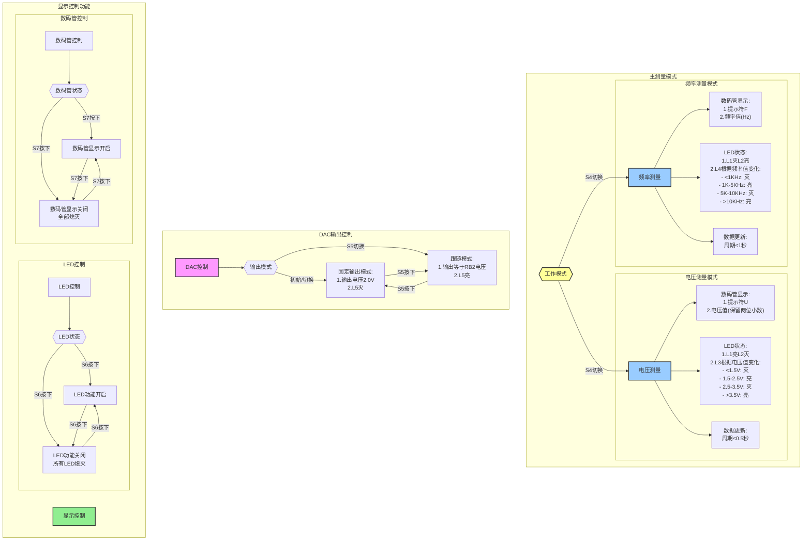

```mermaid
flowchart TB
    subgraph 主测量模式
        mode{{"工作模式"}}
        
        subgraph 电压测量模式
            voltage["电压测量"] --> voltageDisp["数码管显示:\n1.提示符U\n2.电压值(保留两位小数)"]
            voltage --> voltageLED["LED状态:\n1.L1亮L2灭\n2.L3根据电压值变化:\n  - <1.5V: 灭\n  - 1.5-2.5V: 亮\n  - 2.5-3.5V: 灭\n  - >3.5V: 亮"]
            voltage --> voltageUpdate["数据更新:\n周期≤0.5秒"]
        end
        
        subgraph 频率测量模式
            freq["频率测量"] --> freqDisp["数码管显示:\n1.提示符F\n2.频率值(Hz)"]
            freq --> freqLED["LED状态:\n1.L1灭L2亮\n2.L4根据频率值变化:\n  - <1KHz: 灭\n  - 1K-5KHz: 亮\n  - 5K-10KHz: 灭\n  - >10KHz: 亮"]
            freq --> freqUpdate["数据更新:\n周期≤1秒"]
        end
    end

    subgraph DAC输出控制
        dacCtrl["DAC控制"] --> dacMode{{"输出模式"}}
        dacMode -->|"初始/切换"| dacFixed["固定输出模式:\n1.输出电压2.0V\n2.L5灭"]
        dacMode -->|"S5切换"| dacFollow["跟随模式:\n1.输出等于RB2电压\n2.L5亮"]
        dacFixed -->|"S5按下"| dacFollow
        dacFollow -->|"S5按下"| dacFixed
    end

    subgraph 显示控制功能
        dispCtrl["显示控制"]
        
        subgraph LED控制
            ledCtrl["LED控制"] --> ledState{{"LED状态"}}
            ledState -->|"S6按下"| ledON["LED功能开启"]
            ledState -->|"S6按下"| ledOFF["LED功能关闭\n所有LED熄灭"]
            ledON -->|"S6按下"| ledOFF
            ledOFF -->|"S6按下"| ledON
        end
        
        subgraph 数码管控制
            segCtrl["数码管控制"] --> segState{{"数码管状态"}}
            segState -->|"S7按下"| segON["数码管显示开启"]
            segState -->|"S7按下"| segOFF["数码管显示关闭\n全部熄灭"]
            segON -->|"S7按下"| segOFF
            segOFF -->|"S7按下"| segON
        end
    end

    mode -->|"S4切换"| voltage
    mode -->|"S4切换"| freq
    
 
    style mode fill:#ff9,stroke:#333,stroke-width:2px
    style voltage fill:#9cf,stroke:#333,stroke-width:2px
    style freq fill:#9cf,stroke:#333,stroke-width:2px
    style dacCtrl fill:#f9f,stroke:#333,stroke-width:2px
    style dispCtrl fill:#90EE90,stroke:#333,stroke-width:2px
```

