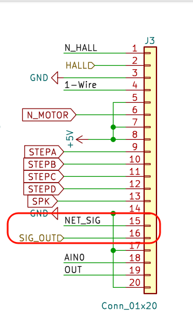

# NE555测量

> 关于NE555的测量，我们有两个点需要提
>
> - 第一个是我们的引脚方面，板子上P34要和singal链接起来，不然没法测量
>
> - 第二个是我们的测量方面，用的是定时器0来作为计数器使用，并且要注意，定时器0要在定时器1之前初始化，否则不准确，如果是矩阵按键，要记得屏蔽最后的按键，定时器0用isp初始化之后加一句` TMOD |= 0x05`就行了，然后`TH0`和`TL0`需要手动清零

```c
void Timer0Init(void)		
{
    AUXR &= 0x7F;		//定时器时钟12T模式
    TMOD &= 0xF0;		//设置定时器模式
    TMOD |= 0x05;	//设置为计数模式
    TL0 = 0;		//设置定时初值
    TH0 = 0;		//设置定时初值
    TF0 = 0;		//清除TF0标志
    TR0 = 1;		//定时器0开始计时
}

if (++Time_1s == 1000)
{
    Time_1s = 0;
    Freq = (TH0 << 8) | TL0;
    TH0 = TL0 = 0;
}
```



# DA输出

> DA输出这里一定一定要给`0x4?`，后面的?代表着你的ad输入，如果题目没有要求使用AD输入，那么你就直接写`0x41`就行了，如果要求了就按照要求的来，并且你读取AD输入的时候一定要带上前面的`4`

# AD读取

> 我们在这里使用x100来直接转换，就不需要使用float进行转换显示了，非常方便，并且使用起来和原本一样的。

```c
unsigned char temp = Ad_Read(0x43);
AD_in_100x = temp * 100 / 51;
// 如果DA跟随AD
if (DA_Out_Mode)
    Da_Write(temp);
// 如果DA固定输出
else
    Da_Write(2 * 51);
```

