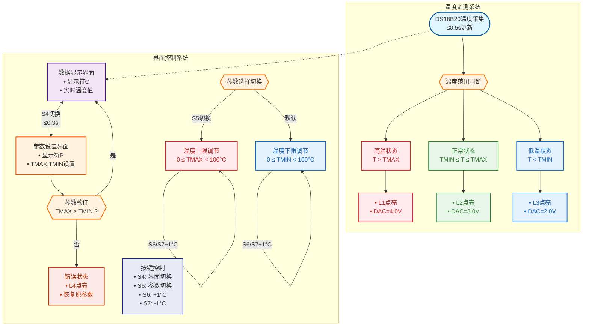

```mermaid
flowchart TB
    %% 样式定义
    classDef tempModule fill:#e1f5fe,stroke:#01579b,stroke-width:2px
    classDef checkPoint fill:#fff3e0,stroke:#ef6c00,stroke-width:2px
    classDef highTemp fill:#ffebee,stroke:#c62828,stroke-width:2px,color:#c62828
    classDef normalTemp fill:#e8f5e9,stroke:#2e7d32,stroke-width:2px,color:#2e7d32
    classDef lowTemp fill:#e3f2fd,stroke:#1565c0,stroke-width:2px,color:#1565c0
    classDef displayModule fill:#f3e5f5,stroke:#4a148c,stroke-width:2px
    classDef paramModule fill:#fff3e0,stroke:#e65100,stroke-width:2px
    classDef errorState fill:#fbe9e7,stroke:#bf360c,stroke-width:2px,color:#bf360c
    classDef buttonControl fill:#e8eaf6,stroke:#1a237e,stroke-width:2px
    
    subgraph 温度监测系统[" 温度监测系统"]
        temp(["DS18B20温度采集\n≤0.5s更新"]):::tempModule
        check{{"温度范围判断"}}:::checkPoint
        
        high["高温状态\nT > TMAX"]:::highTemp
        norm["正常状态\nTMIN ≤ T ≤ TMAX"]:::normalTemp
        low["低温状态\nT < TMIN"]:::lowTemp
        
        highOut["• L1点亮\n• DAC=4.0V"]:::highTemp
        normOut["• L2点亮\n• DAC=3.0V"]:::normalTemp
        lowOut["• L3点亮\n• DAC=2.0V"]:::lowTemp
        
        temp --> check
        check --> high
        check --> norm
        check --> low
        high --> highOut
        norm --> normOut
        low --> lowOut
    end

    subgraph 界面控制系统[" 界面控制系统"]
        dataView["数据显示界面\n• 显示符C\n• 实时温度值"]:::displayModule
        paramView["参数设置界面\n• 显示符P\n• TMAX,TMIN设置"]:::paramModule
        
        paramSet{{"参数选择切换"}}:::checkPoint
        tMax["温度上限调节\n0 ≤ TMAX < 100°C"]:::highTemp
        tMin["温度下限调节\n0 ≤ TMIN < 100°C"]:::lowTemp
        
        valid{{"参数验证\nTMAX ≥ TMIN ?"}}:::checkPoint
        error["错误状态\n• L4点亮\n• 恢复原参数"]:::errorState
        
        buttons["按键控制\n• S4: 界面切换\n• S5: 参数切换\n• S6: +1°C\n• S7: -1°C"]:::buttonControl
        
        dataView <-->|"S4切换\n≤0.3s"| paramView
        paramView --> valid
        valid -->|"是"| dataView
        valid -->|"否"| error
        paramSet -->|"S5切换"| tMax
        paramSet -->|"默认"| tMin
        tMax -->|"S6/S7±1°C"| tMax
        tMin -->|"S6/S7±1°C"| tMin
    end

    %% 连接主要模块
    temp -.-> dataView
```

