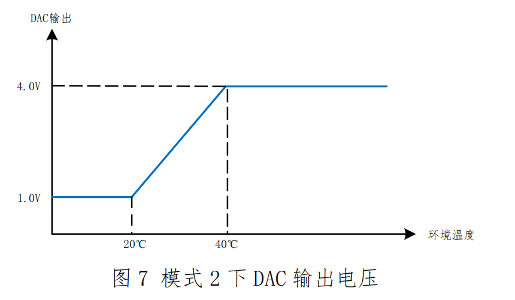

# DA输出参数计算

> 我们在这里的温度，本质上是*100进行的计算，所以要按这个进行计算

$\begin{array}{l}
\frac{{4 - 1}}{{40 - 20}} = \frac{{y - 1}}{{x - 20}}\\
\frac{3}{{20}}\left( {x - 20} \right) + 1 = y\\
\text{温度提高100倍}\\
\frac{{4 - 1}}{{4000 - 2000}} = \frac{{y - 1}}{{x - 2000}}\\
\frac{3}{{2000}}\left( {x - 2000} \right) + 1 = y
\end{array}$

