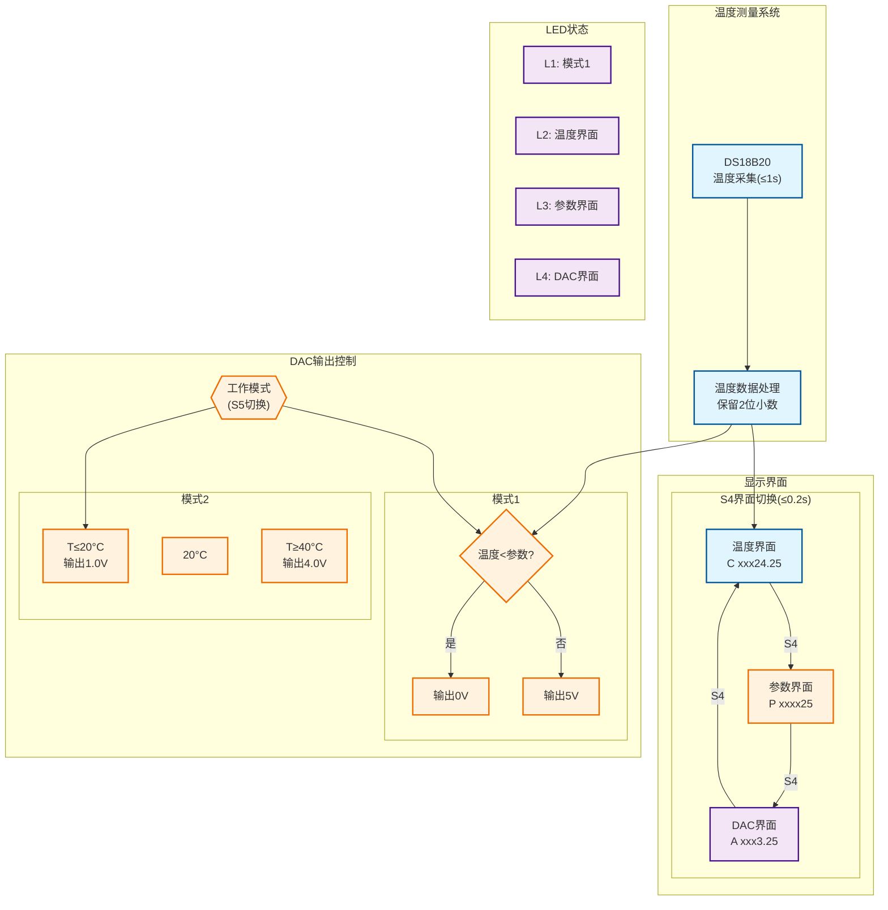

```mermaid
flowchart TB
    %% 样式定义
    classDef tempModule fill:#e1f5fe,stroke:#01579b,stroke-width:2px
    classDef dacModule fill:#fff3e0,stroke:#ef6c00,stroke-width:2px
    classDef dispModule fill:#e8f5e9,stroke:#2e7d32,stroke-width:2px
    classDef ledModule fill:#f3e5f5,stroke:#4a148c,stroke-width:2px

    subgraph 温度系统[" 温度测量系统"]
        direction TB
        ds18b20["DS18B20\n温度采集(≤1s)"]:::tempModule
        tempData["温度数据处理\n保留2位小数"]:::tempModule
        ds18b20 --> tempData
    end

    subgraph 显示系统["显示界面"]
        direction TB
        subgraph 界面切换["S4界面切换(≤0.2s)"]
            tempDisp["温度界面\nC xxx24.25"]:::dispModule
            paramDisp["参数界面\nP xxxx25"]:::dispModule
            dacDisp["DAC界面\nA xxx3.25"]:::dispModule
            
            tempDisp -->|"S4"| paramDisp
            paramDisp -->|"S4"| dacDisp
            dacDisp -->|"S4"| tempDisp
        end
    end

    subgraph DAC控制["DAC输出控制"]
        direction TB
        mode{{"工作模式\n(S5切换)"}}:::dacModule
        
        subgraph 模式1
            direction TB
            comp{"温度<参数?"}:::dacModule
            comp -->|"是"| dac0["输出0V"]:::dacModule
            comp -->|"否"| dac5["输出5V"]:::dacModule
        end
        
        subgraph 模式2
            direction TB
            temp20["T≤20°C\n输出1.0V"]:::dacModule
            temp40["20°C<T<40°C\n线性增加"]:::dacModule
            tempHigh["T≥40°C\n输出4.0V"]:::dacModule
        end
    end

    subgraph LED指示[" LED状态"]
        l1["L1: 模式1"]:::ledModule
        l2["L2: 温度界面"]:::ledModule
        l3["L3: 参数界面"]:::ledModule
        l4["L4: DAC界面"]:::ledModule
    end

    %% 系统连接
    tempData --> tempDisp
    tempData --> comp
    mode --> comp
    mode --> temp20

    style tempDisp fill:#e1f5fe,stroke:#01579b,stroke-width:2px
    style paramDisp fill:#fff3e0,stroke:#ef6c00,stroke-width:2px
    style dacDisp fill:#f3e5f5,stroke:#4a148c,stroke-width:2px
```

