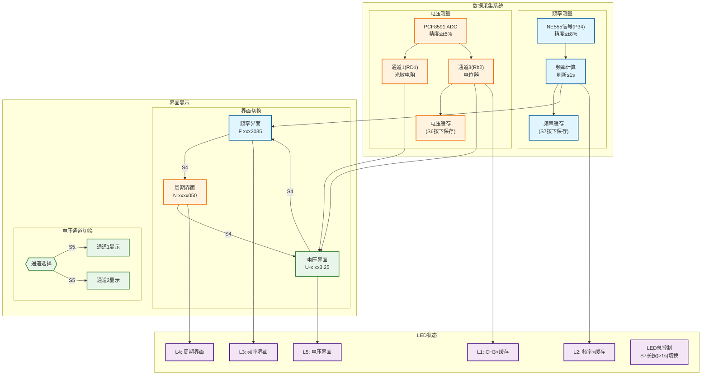

```mermaid
flowchart TB
    %% 样式定义
    classDef freqModule fill:#e1f5fe,stroke:#01579b,stroke-width:2px
    classDef voltModule fill:#fff3e0,stroke:#ef6c00,stroke-width:2px
    classDef dispModule fill:#e8f5e9,stroke:#2e7d32,stroke-width:2px
    classDef ledModule fill:#f3e5f5,stroke:#4a148c,stroke-width:2px
    classDef buttonModule fill:#fce4ec,stroke:#880e4f,stroke-width:2px

    subgraph 数据采集系统["数据采集系统"]
        direction TB
        
        subgraph 频率测量
            direction TB
            freqIn["NE555信号(P34)\n精度≤±8%"]:::freqModule
            freqProc["频率计算\n刷新≤1s"]:::freqModule
            freqSave["频率缓存\n(S7按下保存)"]:::freqModule
            
            freqIn --> freqProc
            freqProc --> freqSave
        end

        subgraph 电压测量
            direction TB
            voltIn["PCF8591 ADC\n精度≤±5%"]:::voltModule
            ch1["通道1(RD1)\n光敏电阻"]:::voltModule
            ch3["通道3(Rb2)\n电位器"]:::voltModule
            voltSave["电压缓存\n(S6按下保存)"]:::voltModule
            
            voltIn --> ch1
            voltIn --> ch3
            ch3 --> voltSave
        end
    end

    subgraph 显示系统["界面显示"]
        direction TB
        
        subgraph 界面切换
            freqView["频率界面\nF xxx2035"]:::dispModule
            periodView["周期界面\nN xxxx050"]:::dispModule
            voltView["电压界面\nU-x xx3.25"]:::dispModule
            
            freqView -->|"S4"| periodView
            periodView -->|"S4"| voltView
            voltView -->|"S4"| freqView
        end

        subgraph 电压通道切换
            chSwitch{{"通道选择"}}:::dispModule
            chSwitch -->|"S5"| ch1Disp["通道1显示"]:::dispModule
            chSwitch -->|"S5"| ch3Disp["通道3显示"]:::dispModule
        end
    end

    subgraph LED指示["LED状态"]
        l1["L1: CH3>缓存"]:::ledModule
        l2["L2: 频率>缓存"]:::ledModule
        l3["L3: 频率界面"]:::ledModule
        l4["L4: 周期界面"]:::ledModule
        l5["L5: 电压界面"]:::ledModule
        ledCtrl["LED总控制\nS7长按(>1s)切换"]:::ledModule
    end

    %% 系统连接
    freqProc --> freqView
    ch1 --> voltView
    ch3 --> voltView
    freqProc --> l2
    ch3 --> l1
    freqView --> l3
    periodView --> l4
    voltView --> l5
    
    style freqView fill:#e1f5fe,stroke:#01579b,stroke-width:2px
    style periodView fill:#fff3e0,stroke:#ef6c00,stroke-width:2px
    style voltView fill:#e8f5e9,stroke:#2e7d32,stroke-width:2px
```

