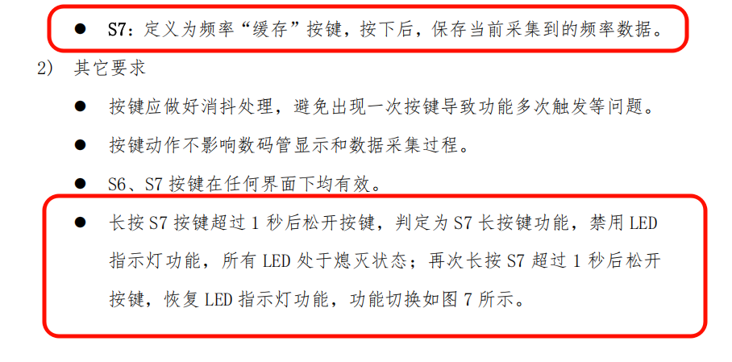

# 按键长短按

> 这里我们有一个功能是长按S7和短按S7，是典型的按键长短按的书写，我们按下后触发一个flag进行计时，当我们抬起的时候我们就检测一下这个flag就行了

```c
if (Key_Down == 7)
    Long_Press_Detection = 1;
if (Key_Up == 7)
{
    Long_Press_Detection = 0;
    if (Time_Tick >= 1000)
        Led_Show_Flag ^= 1;
    else
        Freq_Cache = Freq;
}

```

```C
// 如果正在进行长按检测
if (Long_Press_Detection)
{
    if (++Time_Tick >= 1000)
        Time_Tick = 1001;
}
// 没有进行长按检测
else
    Time_Tick = 0;
```



# AD两个通道先后读取

> 这里我们连续读取是会导致时序紊乱，然后通道值交换，我们最简单的方法就是使用反向一下就行了，并且注意一下，我们最好在底层进行修改一下，读取玩stop后加一个iicdelay255

```c
AD_Channel1_Light_100x = Ad_Read(0x03) * 100 / 51;
AD_Channel3_RB2_100x = Ad_Read(0x01) * 100 / 51;
```

```c
unsigned char Ad_Read(unsigned char addr) {
    unsigned char temp;
    // 选择芯片为PCF
    I2CStart();
    I2CSendByte(0x90);
    I2CWaitAck();
    I2CSendByte(addr);
    I2CWaitAck();

    I2CStart();
    I2CSendByte(0x91);
    I2CWaitAck();
    temp = I2CReceiveByte();
    I2CSendAck(1);
    I2CStop();
    I2C_Delay(255);
    return temp;
}
```

