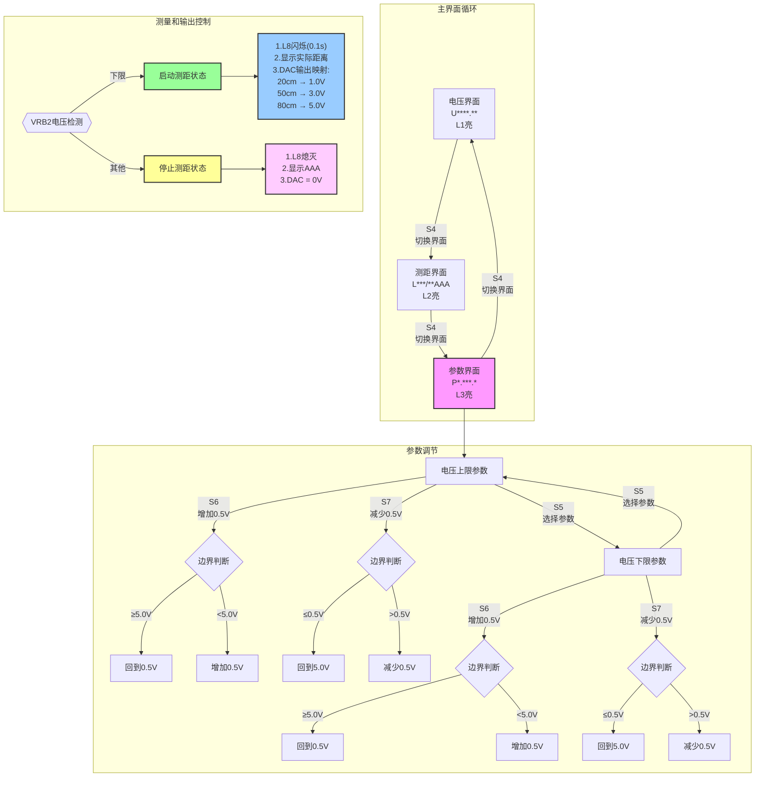

```mermaid
flowchart TB
    subgraph 主界面循环
        电压界面["电压界面\nU****.**\nL1亮"] -->|"S4\n切换界面"| 测距界面
        测距界面["测距界面\nL***/**AAA\nL2亮"] -->|"S4\n切换界面"| 参数界面
        参数界面["参数界面\nP*.***.*\nL3亮"] -->|"S4\n切换界面"| 电压界面
    end

    subgraph 参数调节
        参数界面 --> 上限参数[电压上限参数]
        上限参数 -->|"S5\n选择参数"| 下限参数[电压下限参数]
        下限参数 -->|"S5\n选择参数"| 上限参数
        上限参数 -->|"S6\n增加0.5V"| 参数增加上限{"边界判断"}
        参数增加上限 -->|"≥5.0V"| 回环上限[回到0.5V]
        参数增加上限 -->|"<5.0V"| 增加上限[增加0.5V]
        上限参数 -->|"S7\n减少0.5V"| 参数减少上限{"边界判断"}
        参数减少上限 -->|"≤0.5V"| 回环上限最大[回到5.0V]
        参数减少上限 -->|">0.5V"| 减少上限[减少0.5V]
        
        下限参数 -->|"S6\n增加0.5V"| 参数增加下限{"边界判断"}
        参数增加下限 -->|"≥5.0V"| 回环下限[回到0.5V]
        参数增加下限 -->|"<5.0V"| 增加下限[增加0.5V]
        下限参数 -->|"S7\n减少0.5V"| 参数减少下限{"边界判断"}
        参数减少下限 -->|"≤0.5V"| 回环下限最大[回到5.0V]
        参数减少下限 -->|">0.5V"| 减少下限[减少0.5V]
    end

    subgraph 测量和输出控制
        电压检测{{"VRB2电压检测"}}
        电压检测 -->|"下限<VRB2<上限"| 启动测距["启动测距状态"]
        电压检测 -->|"其他"| 停止测距["停止测距状态"]
        
        启动测距 --> 测距输出["1.L8闪烁(0.1s)\n2.显示实际距离\n3.DAC输出映射:\n  20cm → 1.0V\n  50cm → 3.0V\n  80cm → 5.0V"]
        停止测距 --> 停止输出["1.L8熄灭\n2.显示AAA\n3.DAC = 0V"]
    end

    style 参数界面 fill:#f9f,stroke:#333,stroke-width:2px
    style 启动测距 fill:#9f9,stroke:#333,stroke-width:2px
    style 停止测距 fill:#ff9,stroke:#333,stroke-width:2px
    style 测距输出 fill:#9cf,stroke:#333,stroke-width:2px
    style 停止输出 fill:#fcf,stroke:#333,stroke-width:2px
```

