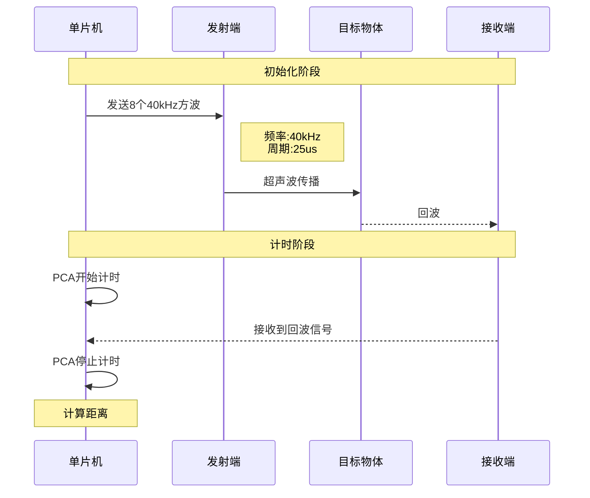

# 超声波测距原理与实现

## 1. 基本原理

超声波测距的基本原理是通过发射超声波并接收其回波,根据声波传播时间计算距离。具体计算公式如下:

$\begin{array}{l}
v = 340m/s = 3.4 \times {10^4}cm/s\\
t = 1us = {10^{ - 6}}s\\
x = \frac{{vt}}{2} = \frac{{3.4 \times {{10}^4} \times {{10}^{ - 6}}}}{2} = 1.7 \times {10^{ - 2}}cm = 0.017cm
\end{array}$

> 注意:公式中的时间单位为us(微秒),最终计算得到的距离单位为cm。

## 2. 时序图



## 3. 硬件实现

本设计采用PCA定时器进行时间测量。选择PCA而不是普通定时器的原因是:

1. 定时器资源有限,需要为其他功能预留
2. 国赛可能需要多个定时器(如第十五届就用到了3个定时器+PCA)
3. PCA具有更高的精度和灵活性

> 超声波模块引脚定义见原理图第一页,TX接P1.0,RX接P1.1

## 4. 关键代码实现

### 4.1 引脚定义与延时函数

```c
sbit US_TX=P1^0;
sbit US_RX=P1^1;

//延时函数(12us@12MHz)
void Delay12us()		
{
	unsigned char i;
	_nop_();
	_nop_();
	i = 38;//可根据实际情况在33~38间调整
	while (--i);
}
```

### 4.2 超声波初始化

```c
void Ut_Wave_Init()
{
	unsigned char i;
	EA=0;  //关闭总中断
	for(i=0;i<8;i++)
	{
		US_TX=1;
		Delay12us();
		US_TX=0;
		Delay12us();
	}
	EA=1;  //恢复中断
}
```

### 4.3 距离测量函数

> PCA配置说明:
> - CMOD=0x00: 选择12T模式
> - PCA开始工作但禁止中断
> 
> 

```c
unsigned char Ut_Wave_Data()
{
	unsigned int time;
	CMOD=0x00;    //配置PCA工作模式
	CH=CL=0;      //计数器清零
	Ut_Wave_Init();//发送超声波
	CR=1;         //启动计数
	while((US_RX==1)&&(CF==0));//等待回波或溢出
	CR=0;         //停止计数
	
	if(CF==0)     //未溢出,测量有效
	{
		time=CH<<8|CL;
		return (time*0.017);//换算成厘米
	}
	else          //溢出,测量无效
	{
		CF=0;
		return 0;
	}
}
```

## 5. 注意事项

1. 发送超声波时需要暂时关闭中断,避免定时不准
2. 延时函数参数需要根据实际情况微调
3. 测量结果单位为厘米(cm)
4. 溢出时返回0表示测量无效 