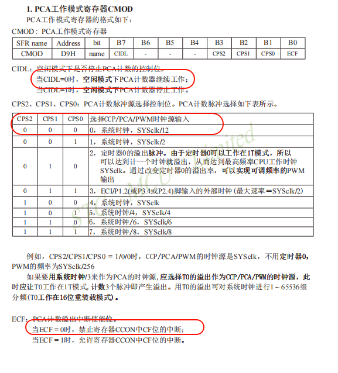

# 超声波采集

$\begin{array}{l}
v = 340m/s = 3.4 \times {10^4}cm/s\\
t = 1us = {10^{ - 6}}s\\
x = \frac{{vt}}{2} = \frac{{3.4 \times {{10}^4} \times {{10}^{ - 6}}}}{2} = 1.7 \times {10^{ - 2}}cm = 0.017cm
\end{array}$

> 公式如上，我们主要是要清楚他的单位，时间这边是us
>
> 我们在这里需要使用PCA定时器来进行采样（虽然可以用定时器2，但是这里需要培养自己的能力，防止国赛的时候定时器不够用【比如第十五届国赛就用到了三个定时器+PCA定时器，所以很有必要学一下怎么用】）

> 这里超声波引脚我们在pdf第一页就能看到，所以不多说，我们使用8个40kHz（1/40kHz=25us）的方波进行发送，注意一下，发送前后关闭一下中断，并且延时不太精准，这里的值自行改动一下i=多少，直接生成的是33，但是我要改到38才正常

```c
sbit US_TX=P1^0;
sbit US_RX=P1^1;

//延时（不精确）
void Delay12us()		//@12.000MHz
{
	unsigned char i;

	_nop_();
	_nop_();
	i = 38;//33~38自行调整
	while (--i);
}
/* 初始化超声波 */
void Ut_Wave_Init()
{
	unsigned char i;
	EA=0;
	for(i=0;i<8;i++)
	{
		US_TX=1;
		Delay12us();
		US_TX=0;
		Delay12us();
	}
	EA=1;
}
```

> 这里的PCA定时器的CMOD里面，0x00就是保证在12T模式下，PCA开始工作，且禁止中断
>
> 
>
> 值得注意的是，我们在发送后开始计时，接收到返回或者溢出了之后，我们要停止计时。

```c
unsigned char Ut_Wave_Data()
{
	unsigned int time;//时间
	CMOD=0x00;//12T模式，PCA工作，禁止中断
	CH=CL=0;//手动给初始值，等待发送
	Ut_Wave_Init();
	CR=1;//开始计时
	while((US_RX==1)&&(CF==0));//没接收到返回并且也没有溢出
	CR=0;
	//接收到返回，没有溢出
	//v=340m/s=3.4*10^4cm/s
	//t=1us=10^(-6)s
	//x=vt/2=1.7*10^(-2)cm=0.017cm
	if(CF==0)
	{
		time=CH<<8|CL;
		return (time*0.017);//cm
	}
	//接收到返回前溢出，测量无效
	else 
	{
		CF=0;
		return 0;
	}
}

```

