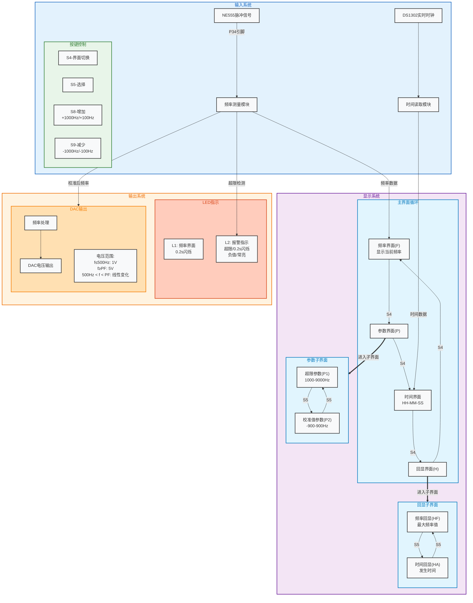

```mermaid
flowchart TB
    %% Style Definitions
    classDef default fill:#f8f9fa,stroke:#333,stroke-width:2px
    classDef input fill:#e3f2fd,stroke:#1565c0,stroke-width:2px,color:#1565c0
    classDef display fill:#f3e5f5,stroke:#6a1b9a,stroke-width:2px,color:#6a1b9a
    classDef output fill:#fff3e0,stroke:#ef6c00,stroke-width:2px,color:#ef6c00
    classDef control fill:#e8f5e9,stroke:#2e7d32,stroke-width:2px,color:#2e7d32
    classDef interface fill:#e1f5fe,stroke:#0277bd,stroke-width:2px,color:#0277bd
    classDef subInterface fill:#bbdefb,stroke:#1976d2,stroke-width:2px,color:#1976d2
    classDef led fill:#ffccbc,stroke:#d84315,stroke-width:2px,color:#d84315
    classDef dac fill:#ffe0b2,stroke:#f57c00,stroke-width:2px,color:#f57c00

    subgraph InputSystem["输入系统"]
        direction TB
        NE555["NE555脉冲信号"] --> |"P34引脚"| FreqMeasure["频率测量模块"]
        DS1302["DS1302实时时钟"] --> TimeRead["时间读取模块"]
        
        subgraph KeyControl["按键控制"]
            direction LR
            S4["S4-界面切换"] 
            S5["S5-选择"]
            S8["S8-增加<br>+1000Hz/+100Hz"]
            S9["S9-减少<br>-1000Hz/-100Hz"]
        end
    end

    subgraph DisplaySystem["显示系统"]
        direction TB
        subgraph MainInterface["主界面循环"]
            direction LR
            FreqInterface["频率界面(F)<br>显示当前频率"] -->|"S4"| ParamInterface["参数界面(P)"]
            ParamInterface -->|"S4"| TimeInterface["时间界面<br>HH-MM-SS"]
            TimeInterface -->|"S4"| HistoryInterface["回显界面(H)"]
            HistoryInterface -->|"S4"| FreqInterface
        end

        subgraph ParamSubInterface["参数子界面"]
            direction TB
            ParamLimitInterface["超限参数(P1)<br>1000-9000Hz"] -->|"S5"| CalibrationInterface["校准值参数(P2)<br>-900-900Hz"]
            CalibrationInterface -->|"S5"| ParamLimitInterface
        end

        subgraph HistorySubInterface["回显子界面"]
            direction TB
            FreqHistoryInterface["频率回显(HF)<br>最大频率值"] -->|"S5"| TimeHistoryInterface["时间回显(HA)<br>发生时间"]
            TimeHistoryInterface -->|"S5"| FreqHistoryInterface
        end
    end

    %% Interface Connections
    ParamInterface ==>|"进入子界面"| ParamSubInterface
    HistoryInterface ==>|"进入子界面"| HistorySubInterface

    subgraph OutputSystem["输出系统"]
        direction TB
        subgraph LEDIndicators["LED指示"]
            L1["L1: 频率界面<br>0.2s闪烁"]
            L2["L2: 报警指示<br>超限/0.2s闪烁<br>负值/常亮"]
        end

        subgraph DACOutput["DAC输出"]
            direction TB
            FreqProcess["频率处理"] --> DACVoltage["DAC电压输出"]
            DACRange["电压范围:<br>f≤500Hz: 1V<br>f≥PF: 5V<br>500Hz < f < PF: 线性变化"]
        end
    end

    %% System Connections
    FreqMeasure -->|"频率数据"| FreqInterface
    FreqMeasure -->|"超限检测"| L2
    FreqMeasure -->|"校准后频率"| DACOutput
    TimeRead -->|"时间数据"| TimeInterface

    %% Apply Styles
    class InputSystem input
    class DisplaySystem display
    class OutputSystem output
    class KeyControl control
    class MainInterface,ParamSubInterface,HistorySubInterface interface
    class LEDIndicators led
    class DACOutput dac
```
