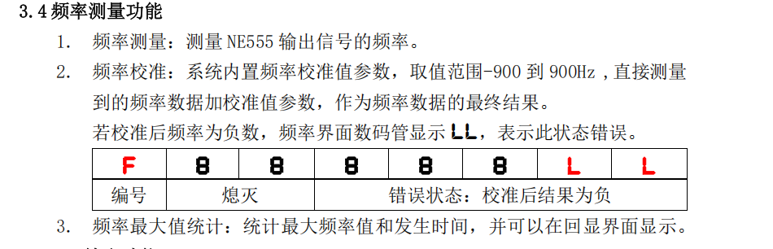

# 频率显示

> 这套题严格意义上讲是非常简单的（我个人认为甚至比第十四届更简单）。但主要需要在细节方面多加注意。

> 最重要也是最核心的一点是频率显示和最大值(max)的计算。题目明确要求，我们测量到的频率需要经过校验值计算后，才能进行其他操作，包括：
>
> - 最大值捕获
> - 最大值时间捕获
> - 第一个界面的频率显示
>
> 所有显示和计算都必须使用经过校验后的频率值，这一点必须牢记。



# 数据类型与负数处理

> 在处理负数时，我们可以直接使用有符号类型（不使用unsigned），但需要特别注意数据范围。在51单片机中，各数据类型的范围如下：
>
> - unsigned int: 0 ~ 65535 (0x0000 ~ 0xFFFF)
> - int: -32768 ~ 32767 (-0x8000 ~ 0x7FFF)
> - unsigned char: 0 ~ 255 (0x00 ~ 0xFF)
> - char: -128 ~ 127 (-0x80 ~ 0x7F)

> 在进行signed和unsigned混合运算时需要特别注意：
>
> 1. unsigned int 和 int 混合运算时，编译器会自动将 int 转换为 unsigned int
> 2. 这种隐式转换可能导致负数的补码表示出现问题
> 3. 为避免这个问题，建议在计算前将负数取相反数，使用正数进行运算，最后再根据需要还原符号
>
> 示例：
>
> ```c
> int a = -100;
> unsigned int b = 50;
> // 错误的做法
> int result1 = a + b;  // 可能得到意外结果
>
> // 正确的做法
> int result2 = (-a) - b;  // 先取相反数，再进行运算
> result2 = -result2;      // 最后恢复符号
> ```
