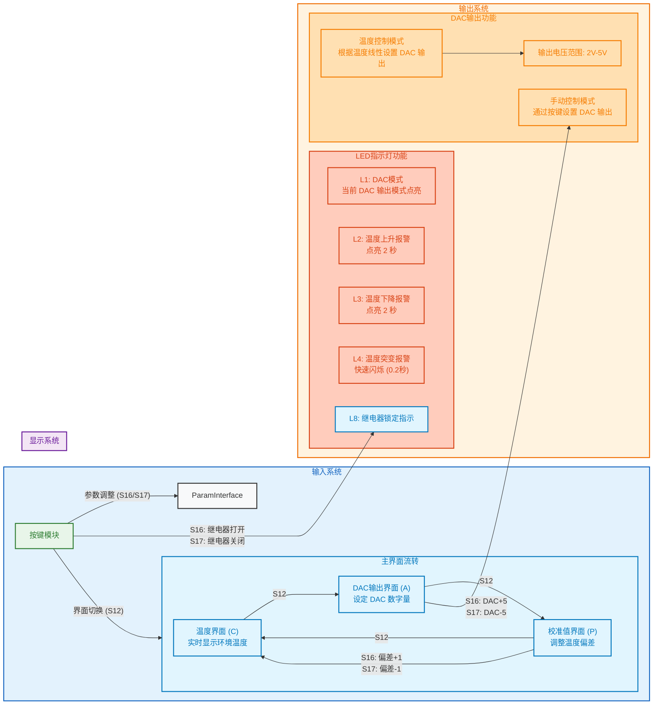

```mermaid
flowchart LR
    %% Style Definitions
    classDef default fill:#f8f9fa,stroke:#333,stroke-width:2px
    classDef input fill:#e3f2fd,stroke:#1565c0,stroke-width:2px,color:#1565c0
    classDef display fill:#f3e5f5,stroke:#6a1b9a,stroke-width:2px,color:#6a1b9a
    classDef output fill:#fff3e0,stroke:#ef6c00,stroke-width:2px,color:#ef6c00
    classDef control fill:#e8f5e9,stroke:#2e7d32,stroke-width:2px,color:#2e7d32
    classDef interface fill:#e1f5fe,stroke:#0277bd,stroke-width:2px,color:#0277bd
    classDef subInterface fill:#bbdefb,stroke:#1976d2,stroke-width:2px,color:#1976d2
    classDef led fill:#ffccbc,stroke:#d84315,stroke-width:2px,color:#d84315
    classDef dac fill:#ffe0b2,stroke:#f57c00,stroke-width:2px,color:#f57c00

    %% Input System
    subgraph InputSystem["输入系统"]
        direction TB
        Buttons["按键模块"]:::control
        Buttons --> |"界面切换 (S12)"| MainInterface
        Buttons --> |"参数调整 (S16/S17)"| ParamInterface
    end

    %% Display System
    subgraph DisplaySystem["显示系统"]
        direction TB

        subgraph MainInterface["主界面流转"]
            direction TB
            
            TempInterface["温度界面 (C)<br>实时显示环境温度"]:::interface
            DACControlInterface["DAC输出界面 (A)<br>设定 DAC 数字量"]:::interface
            CalibrationInterface["校准值界面 (P)<br>调整温度偏差"]:::interface
            TempInterface --> |"S12"| DACControlInterface
            DACControlInterface --> |"S12"| CalibrationInterface
            CalibrationInterface --> |"S12"| TempInterface
        end
    end

    %% Output System
    subgraph OutputSystem["输出系统"]
        direction TB

        subgraph LEDIndicators["LED指示灯功能"]
            direction TB
            DACModeLED["L1: DAC模式<br>当前 DAC 输出模式点亮"]:::led
            TempRiseLED["L2: 温度上升报警<br>点亮 2 秒"]:::led
            TempDropLED["L3: 温度下降报警<br>点亮 2 秒"]:::led
            SuddenChangeLED["L4: 温度突变报警<br>快速闪烁 (0.2秒)"]:::led
            RelayLockLED["L8: 继电器锁定指示"]:::led
        end

        subgraph DACOutput["DAC输出功能"]
            direction TB
            TempToDAC["温度控制模式<br>根据温度线性设置 DAC 输出"]:::dac
            ManualControlDAC["手动控制模式<br>通过按键设置 DAC 输出"]:::dac
            TempToDAC --> DACOutputVoltage["输出电压范围: 2V-5V"]:::dac
        end
    end

    %% Connections Between Modules
    %% Input Connections
    Buttons --> |"S16: 继电器打开<br>S17: 继电器关闭"| RelayLockLED
    DACControlInterface --> |"S16: DAC+5<br>S17: DAC-5"| ManualControlDAC
    CalibrationInterface --> |"S16: 偏差+1<br>S17: 偏差-1"| TempInterface

    %% Apply Styles
    class InputSystem input
    class DisplaySystem display
    class OutputSystem output
    class MainInterface,TempInterface,DACControlInterface,CalibrationInterface,RelayLockLED interface
    class LEDIndicators led
    class TempToDAC,ManualControlDAC,DACOutput dac

```
