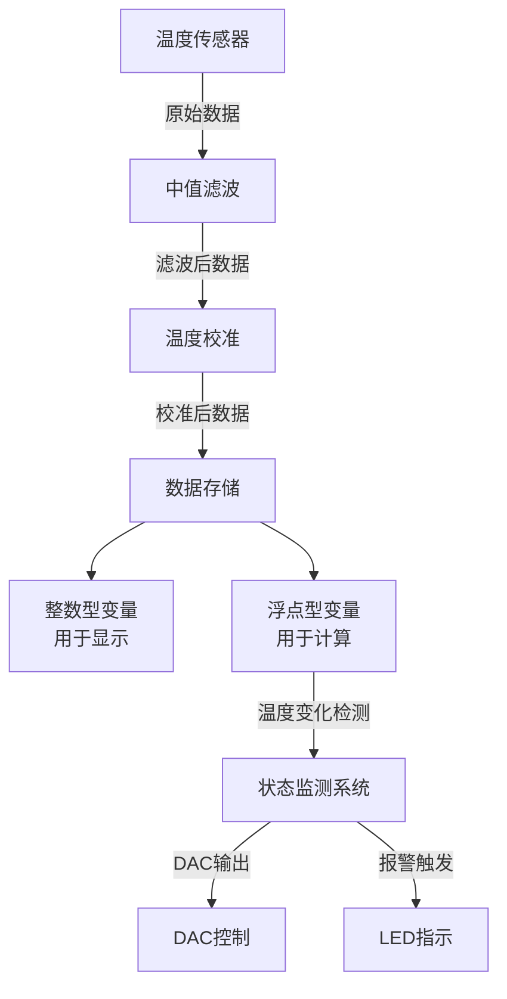
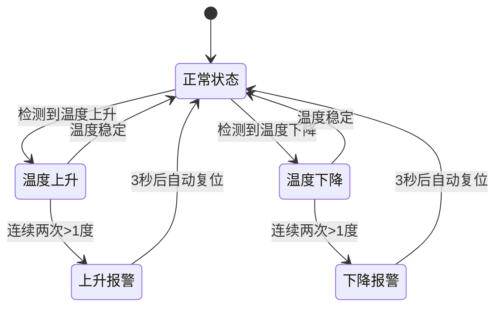
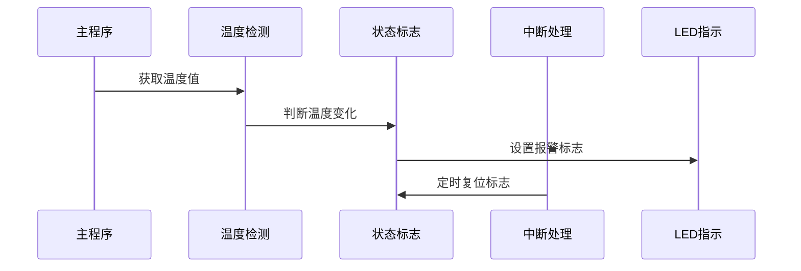

# 温度测量系统设计文档

## 系统架构

### 整体流程

以下流程图展示了温度测量系统的数据流转过程：



## 温度测量实现

### 温度数据处理

温度测量系统采用双变量存储策略：

- 整数型变量用于显示，保证界面简洁
- 浮点型变量用于计算，确保精确度

核心代码实现：

```c
idata unsigned char Temperature_Calibrate_Value = 0;    // 温度校准后的值
idata float Temperature_Calibrate_Value_Float = 0;     // 校准后的值，浮点数，用于判断温度上升情况
float temp = rd_temperature();
temp = Median_Filter(temp) + Para_Calibrate;
```

### 状态转换流程

温度状态机展示了系统的工作状态转换：



### 状态标志管理

系统采用时序控制方式处理状态标志：



#### 状态管理说明

### 温度变化处理

```c
float temp = rd_temperature();
temp = Median_Filter(temp) + Para_Calibrate;

// 温度下降处理
if (Temperature_Calibrate_Value_Float > temp)
{
    Temperature_Down_Flag = 1;
    Temperature_Up_Wring = 0;
    Time_2s_Down = 0;
    // 下降超过1度
    if (Temperature_Calibrate_Value_Float - temp > 1)
    {
        if (Temperature_Down_Wring == 0)
            Temperature_Down_Wring = 1;    // 第一次超过1度
        else
        {
            Temperature_Wring = 1;        // 第二次超过1度
            Time_200ms_Light = 0;
            Time_3s_Wring = 0;            // 清零计时
        }
    }
    else
    {
        Temperature_Down_Wring = 0;
    }
}

// 温度上升处理
else if (Temperature_Calibrate_Value_Float < temp)
{
    Temperature_Up_Flag = 1;
    Time_2s_Up = 0;
    Temperature_Down_Wring = 0;
    // 上升超过1度
    if (temp - Temperature_Calibrate_Value_Float > 1)
    {
        if (Temperature_Up_Wring == 0)
            Temperature_Up_Wring = 1;      // 第一次超过1度
        else
        {
            Temperature_Wring = 1;        // 第二次超过1度
            Time_200ms_Light = 0;
            Time_3s_Wring = 0;            // 清零计时
        }
    }
    else
    {
        Temperature_Up_Wring = 0;
    }
}

// 更新温度值和DAC输出
Temperature_Calibrate_Value_Float = temp;
Temperature_Calibrate_Value = Temperature_Calibrate_Value_Float;

// DAC输出控制
if (Temperature_Calibrate_Value_Float <= 10)
    Dac_Digit_Temperature = 2 * 51;
else if (Temperature_Calibrate_Value_Float >= 40)
    Dac_Digit_Temperature = 5 * 51;
else
    Dac_Digit_Temperature = (Temperature_Calibrate_Value_Float / 10.0f + 1) * 51;
```
