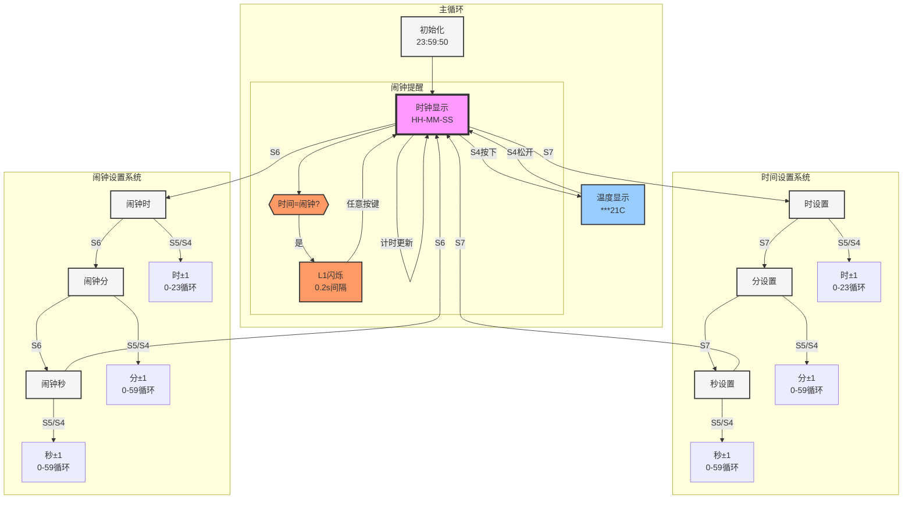

```mermaid
flowchart TB
    subgraph 主循环
        direction LR
        init["初始化\n23:59:50"] --> clock
        clock["时钟显示\nHH-MM-SS"] --> |"计时更新"| clock
        clock --> |"S4按下"| temp["温度显示\n***21C"]
        temp --> |"S4松开"| clock
        
        subgraph 闹钟提醒
            direction TB
            check{{"时间=闹钟?"}} --> |是| alarm["L1闪烁\n0.2s间隔"]
            alarm --> |"任意按键"| clock
        end
        clock --> check
    end

    subgraph 时间设置系统
        direction LR
        clock --> |"S7"| hour["时设置"] --> |"S7"| min["分设置"] --> |"S7"| sec["秒设置"]
        sec --> |"S7"| clock
        
        hour --> |"S5/S4"| hourAdj["时±1\n0-23循环"]
        min --> |"S5/S4"| minAdj["分±1\n0-59循环"]
        sec --> |"S5/S4"| secAdj["秒±1\n0-59循环"]
    end

    subgraph 闹钟设置系统
        direction LR
        clock --> |"S6"| alarmH["闹钟时"] --> |"S6"| alarmM["闹钟分"] --> |"S6"| alarmS["闹钟秒"]
        alarmS --> |"S6"| clock
        
        alarmH --> |"S5/S4"| aHAdj["时±1\n0-23循环"]
        alarmM --> |"S5/S4"| aMAdj["分±1\n0-59循环"]
        alarmS --> |"S5/S4"| aSAdj["秒±1\n0-59循环"]
    end

    classDef highlight fill:#f9f,stroke:#333,stroke-width:4px
    classDef normal fill:#f5f5f5,stroke:#333,stroke-width:2px
    classDef alarm fill:#f96,stroke:#333,stroke-width:2px
    classDef temp fill:#9cf,stroke:#333,stroke-width:2px
    
    class clock highlight
    class init,hour,min,sec,alarmH,alarmM,alarmS normal
    class alarm,check alarm
    class temp temp
```

