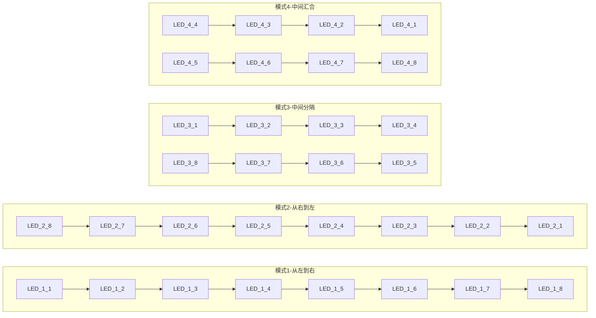
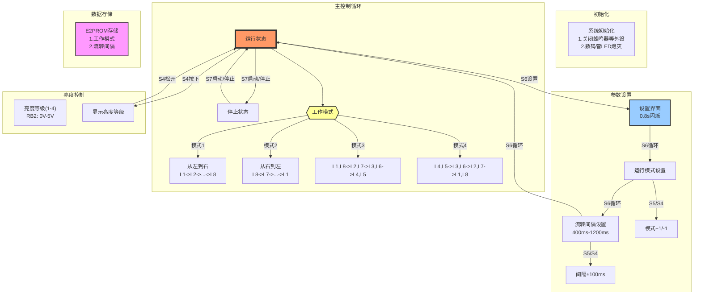

```mermaid
flowchart LR
        subgraph mode1[模式1-从左到右]
            direction LR  %% 内部模式为横向排列
            LED_1_1 --> LED_1_2 --> LED_1_3 --> LED_1_4 --> LED_1_5 --> LED_1_6 --> LED_1_7 --> LED_1_8
        end
        
        subgraph mode2[模式2-从右到左]
            direction LR
            LED_2_8 --> LED_2_7 --> LED_2_6 --> LED_2_5 --> LED_2_4 --> LED_2_3 --> LED_2_2 --> LED_2_1
        end
        
        subgraph mode3[模式3-中间分隔]
            direction LR
            LED_3_1 --> LED_3_2 --> LED_3_3 --> LED_3_4
            LED_3_8 --> LED_3_7 --> LED_3_6 --> LED_3_5
        end
        
        subgraph mode4[模式4-中间汇合]
            direction LR
            LED_4_4 --> LED_4_3 --> LED_4_2 --> LED_4_1
            LED_4_5 --> LED_4_6 --> LED_4_7 --> LED_4_8
        end
    

```

```mermaid
flowchart TB
    subgraph 初始化
        init["系统初始化\n1.关闭蜂鸣器等外设\n2.数码管LED熄灭"]
    end

    subgraph 主控制循环
        run["运行状态"] -->|"S7启动/停止"| stop["停止状态"]
        stop -->|"S7启动/停止"| run
        run --> modes{{"工作模式"}}
        
        modes -->|"模式1"| mode1["从左到右\nL1->L2->...->L8"]
        modes -->|"模式2"| mode2["从右到左\nL8->L7->...->L1"]
        modes -->|"模式3"| mode3["L1,L8->L2,L7->L3,L6->L4,L5"]
        modes -->|"模式4"| mode4["L4,L5->L3,L6->L2,L7->L1,L8"]
    end

    subgraph 参数设置
        run -->|"S6设置"| config["设置界面\n0.8s闪烁"]
        config -->|"S6循环"| modeSet["运行模式设置"]
        modeSet -->|"S6循环"| timeSet["流转间隔设置\n400ms-1200ms"]
        timeSet -->|"S6循环"| run

        modeSet -->|"S5/S4"| modePlus["模式+1/-1"]
        timeSet -->|"S5/S4"| timePlus["间隔±100ms"]
    end

    subgraph 亮度控制
        brightness["亮度等级(1-4)\nRB2: 0V-5V"] 
        run -->|"S4按下"| showLevel["显示亮度等级"]
        showLevel -->|"S4松开"| run
    end

    subgraph 数据存储
        E2PROM["E2PROM存储\n1.工作模式\n2.流转间隔"]
    end

    style run fill:#f96,stroke:#333,stroke-width:4px
    style config fill:#9cf,stroke:#333,stroke-width:2px
    style modes fill:#ff9,stroke:#333,stroke-width:2px
    style E2PROM fill:#f9f,stroke:#333,stroke-width:2px
```

