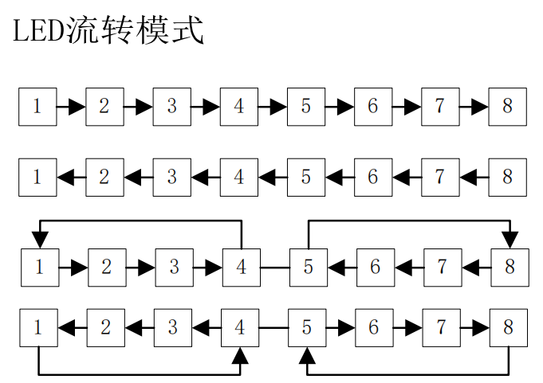

# EEPROM校验

> 我们在读取EEPROM的时候，我们要注意，如果你是第一次读取EEPROM的数据（因为你本身要从EEPROM里面读取数据来填充设置的值），那么你需要校验一下，否则你第一次读取到数据就是乱掉到（因为EEPROM如果没有写东西到话，是一个随机值0~255）
>
> 我们的校验思路就是，当我们进行数据存放的时候，我们同时对一个没有用到的地址直接写入一个任意值，这样相当于我们打一个标记，证明我们写入过数据
>
> 具体代码如下，我们设置了一个lock，然后我们写入数据的时候顺便把lock写进去，在我们进行读取的时候首先读取一下这个地址的数据，判断这个数据和我们的lock是否一致，如果一致的话就代表我们之前写入过，我们就可以进行数据读取了，否则我们就不读取

```c
idata unsigned char EEPROM_Lock=5;//EEPROM校验值
if(Setting_Mode)
{
    for(i=0;i<4;i++)
    {
        //将控制值赋给实际值
        Led_Running_Time[i]=Led_Running_Time_Ctrl[i];
        //将控制值写入EEPROM数组
        EEPROM_Dat[i]=Led_Running_Time_Ctrl[i]/100;
    }
    EEPROM_Write(EEPROM_Dat,0,4);
    EEPROM_Write(&EEPROM_Lock,8,1);
    Setting_Mode=0;
    Seg_Show_Mode=0;
}
```

```c
unsigned char EEPROM_Temp;
EEPROM_Read(&EEPROM_Temp,8,1);
//之前写入了数据
if(EEPROM_Temp==EEPROM_Lock)
{
    EEPROM_Read(EEPROM_Dat,0,4);
    for(i=0;i<4;i++)
        Led_Running_Time[i]=EEPROM_Dat[i]*100;
}
```

# LED流转

> 在这里面其实LED流转是一个数学问题，我们只需要把握好LED的这个流转规律就好了
>
> 我们每次流转时间到了之后就让我们的Led_Pos这个时间往后走一个，这样就可以控制Led的状态
>
> 
>
> 代码如下（这里需要注意一下，我们的灯是要在系统的标志开始后才流转，所以有一个if）

```c
if(System_Flag)
{
    switch(Led_Running_Now)
    {
        case 0:
            for(i=0;i<8;i++)
                ucLed[i]=(i==Led_Pos);
            break;
        case 1:
            for(i=0;i<8;i++)
                ucLed[7-i]=(i==Led_Pos);
            break;
        case 2:
            for(i=0;i<4;i++)
            {
                ucLed[i]=(i==Led_Pos);
                ucLed[7-i]=(i==Led_Pos);
            }
            break;
        case 3:
            for(i=0;i<4;i++)
            {
                ucLed[3-i]=(i==Led_Pos);
                ucLed[4+i]=(i==Led_Pos);
            }
            break;
    }
}
```

# 高位隐

> 在这里我们有高位隐藏的操作，其实这个方法有很多，除了我在代码里面的大于等于1000以外，你还可以直接用这个值/1000，如果结果不为0，那么就可以不用隐藏，下面两个写法是等价的，通常使用下面那个

```c
Seg_Buf[0]=(data>=1000)?data/1000:10;
Seg_Buf[0]=(data/1000==0)?10:data/1000;
```

